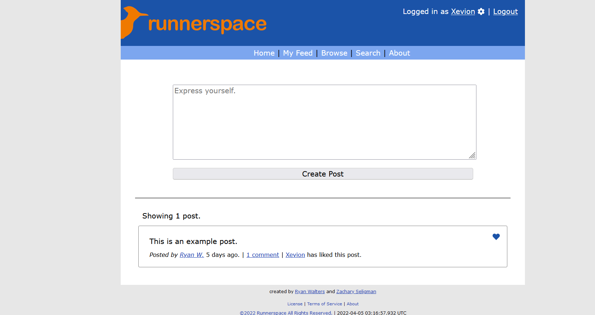
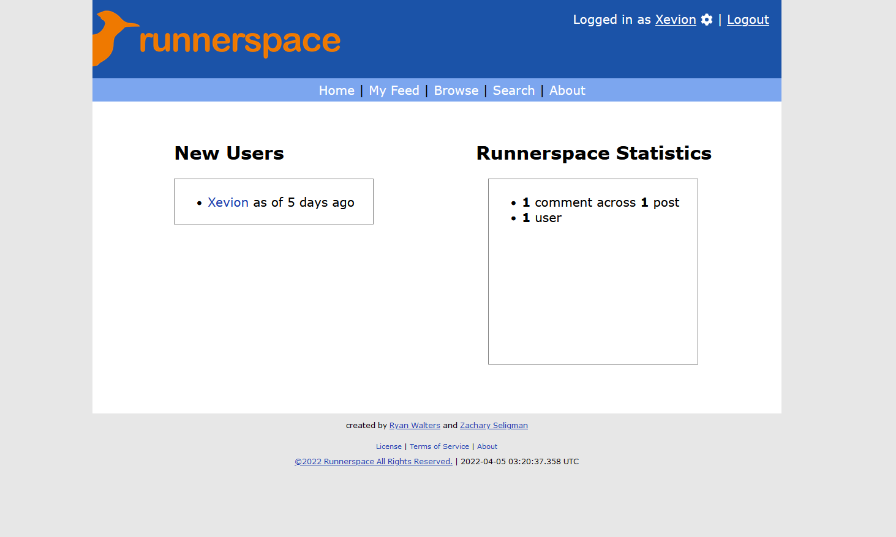
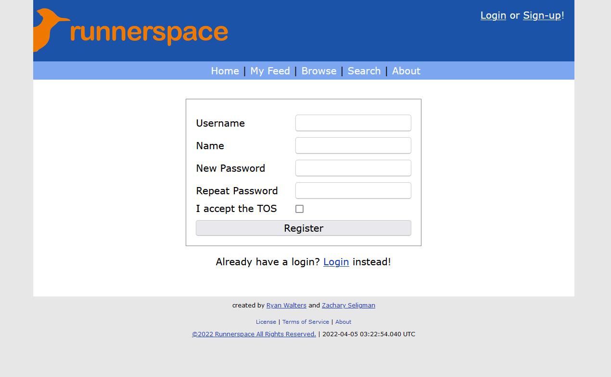
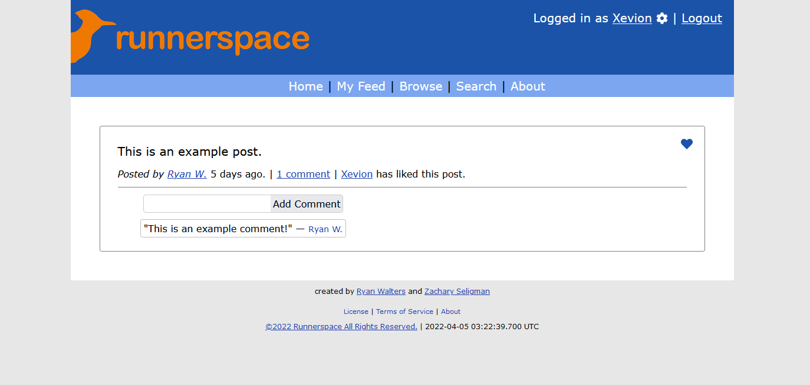
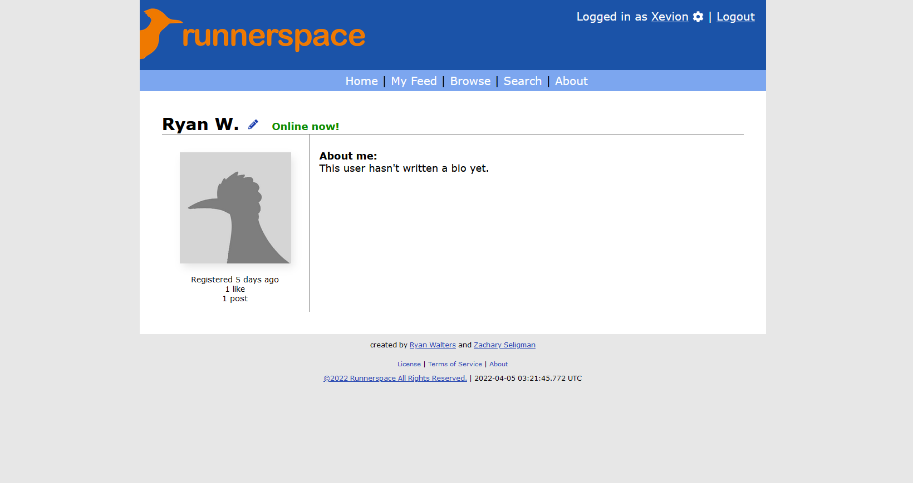

# runnerspace

[![Runnerspace Banner][banner-url]][deployment-url]

Introducing Runnerspace - a retro, UTSA-themed MySpace clone developed as part of the 'Retro' challenge during
RowdyHacks 2022. This project was completed in under 36 hours and has since been further enhanced to serve as a
portfolio project, now hosted on Railway.

<div align="center">
  Explore Runnerspace by clicking <a href="https:/runnerspace.xevion.dev">here</a>.
</div>

## About

Our team created a MySpace-inspired platform for the UTSA student community during RowdyHacks 2022. Drawing inspiration
from the popular social media services of its era, we developed the application in just under 24 hours and presented a
fully-functional demo for judging at the event.

Despite starting almost 5 hours into the hackathon, we were able to
deliver a polished product that captured the retro essence of MySpace.

## Screenshots







## Features

- Accounts
    - Signup
    - Login/Logout + Remember Me
    - Administrative Access
    - Profile Editing
    - Profile Viewing
    - Online and Offline account flags
- Posts
    - Post Creation
        - Comment posting
    - Post Feed + Comment Stats
    - AJAX Post Liking System
- Appearance
    - Customized to look like MySpace; UTSA themed
    - CSS written to be usable on most laptops/desktops
    - MySpace-like Theme
        - Image used, although text-based logo fallback available
- Misc
    - Easy install & setup with `pipenv`
    - Hosted on [Railway][deployment-url]!
    - Profanity filtering
    - Human + Computer Readable Timestamps
        - "3 minutes ago" and such...
    - Global Header & Footer
    - License Page
    - About Page
    - UTC Timestamped Page Rendering

## Tech Stack

- Flask
    - Jinja Templating
    - SQLAlchemy + SQLite
- Sass
- Font Awesome Icons
- Railway
- Other
    - Humanize
    - Faker
    - `better-profanity`

# Development Setup

Developed on Python 3.8.0 - thus we recommend this version specifically.

```bash
pip install pipenv
pipenv install
flask run
```

[banner-url]: ./static/runnerspace-banner-slim.png

[deployment-url]: https://runnerspace.xevion.dev/
